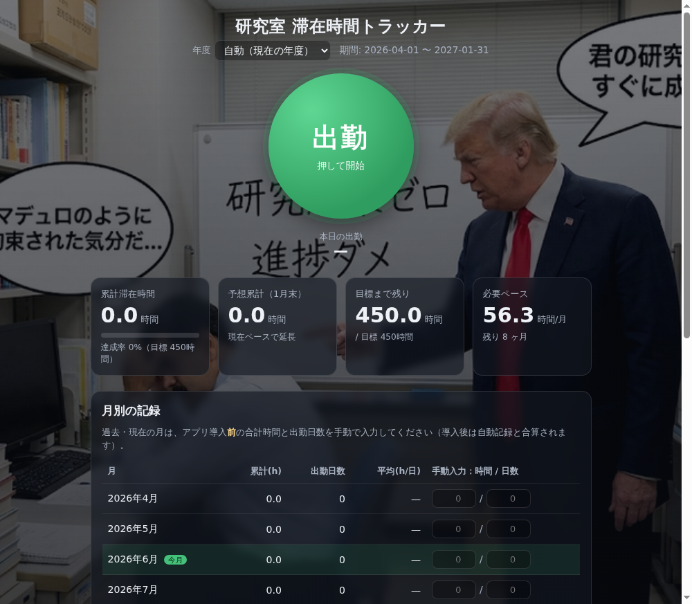
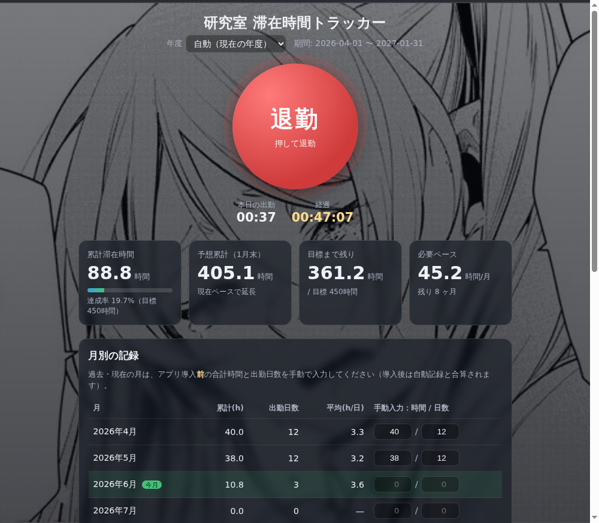

  
  <h1>研究室 滞在時間トラッカー 使い方ガイド</h1>
  
中央のボタンを押すだけ。研究室の滞在時間を記録して、<b>1月末までの450時間</b>を見える化するアプリです。

> 📌 このガイドは研究室のみんな向けです。スマホ・PC操作が苦手でも大丈夫。順番にやればOKです。

---

## もくじ
1. [インストール（最初の1回だけ）](#1-インストール最初の1回だけ)
2. [基本の使い方：出勤と退勤](#2-基本の使い方出勤と退勤)
3. [画面の見方](#3-画面の見方)
4. [月別の記録と「手動入力」](#4-月別の記録と手動入力)
5. [記録の修正・退勤の押し忘れ](#5-記録の修正退勤の押し忘れ)
6. [来年度以降も使える（年度の切り替え）](#6-来年度以降も使える年度の切り替え)
7. [バックアップ](#7-バックアップ)
8. [背景が変わるお楽しみ](#8-背景が変わるお楽しみ)
9. [よくある質問（FAQ）](#9-よくある質問faq)

---

## 1. インストール（最初の1回だけ）

1. 配布ページ（最新版）を開く 👉 **https://github.com/Aoto3778/Aoto3778/releases/latest**
2. ページ下の **「Assets（アセット）」** を開き、**`LabTimeTracker-Setup-x.y.z.exe`** をクリックしてダウンロード
3. ダウンロードした **`.exe` をダブルクリック**
4. 「**Windows によって PC が保護されました**」と出たら → **「詳細情報」→「実行」** をクリック
   （※署名証明書が無いだけで、危険なものではありません）
5. インストール完了！ スタートメニュー／デスクトップの **「研究室滞在時間トラッカー」** から起動できます

 ▲ 最初の画面。まんなかの大きなボタンを押すだけ。

---

## 2. 基本の使い方：出勤と退勤

たったこれだけです👇

- 研究室に**来たら** → まんなかの**緑の「出勤」ボタン**を押す（タイマーが動き出します）
- 研究室を**出るとき** → **赤い「退勤」ボタン**を押す（滞在時間が記録されます）

 ▲ 出勤中は「退勤」ボタン＋経過時間がリアルタイムで表示されます。

> 💡 押し忘れても後から直せます（→[5番](#5-記録の修正退勤の押し忘れ)）。

---

## 3. 画面の見方

ボタンの下／カードに、いまの状況が出ます。

| 表示 | 意味 |
| --- | --- |
| **本日の出勤** | 今日いちばん最初に出勤した時刻 |
| **経過** | いまの滞在時間（出勤中だけ表示・1秒ごとに更新） |
| **累計滞在時間** | 今年度の合計時間（下のバーは目標450hの達成率） |
| **予想累計（1月末）** | いまのペースだと1月末に何時間になりそうか |
| **目標まで残り** | 450時間まであと何時間 |
| **必要ペース** | 目標達成に、今月以降「1ヶ月あたり何時間」必要か |

> 使い始めた最初の2週間ほどは予想が安定しないので「**暫定**」と表示されます。

---

## 4. 月別の記録と「手動入力」

表で各月の **累計時間 / 出勤日数 / 1日あたり平均** を確認できます（今月は緑色）。

### アプリを使う前の分は手で入力します
アプリを入れる前の滞在時間は自動で取れないので、各月の右側 **「手動入力：時間 / 日数」** に入れてください。

- 例）4月に **合計40時間・12日** 通った → 左に `40`、右に `12`
- **今月の途中から**使い始めた場合：使う前の分だけ手入力 → それ以降はボタンで自動記録され、**合算**されます（二重に数えないよう「使う前の分だけ」入れてください）

---

## 5. 記録の修正・退勤の押し忘れ

「**出退勤の記録**」の各行で：

- **編集** … 出勤・退勤の時刻を直せます
- **削除** … その記録を消せます

**退勤を押し忘れて帰ってしまったとき：**
次にアプリを開くと、上に黄色い帯（「前回の退勤が記録されていません」）が出ます。
- **「今すぐ退勤」** … 今の時刻で退勤にする
- **「記録を編集」** … 正しい退勤時刻に直す

どちらかで直せばOKです。

---

## 6. 来年度以降も使える（年度の切り替え）

- **毎年4月に自動で新年度に切り替わります。** 累計や450時間の目標もその年度だけで数え直されます。**入れ直し不要**です。
- 過去の年度を見たいときは、画面上部の **「年度」** から選んでください（青い帯が出て、その年度の記録に切り替わります）。**「今年度に戻る」** で戻れます。
- 過去の年度を見ているときでも、**出勤・退勤ボタンはいつも「今」の日時で記録**されます。

---

## 7. バックアップ

データは **このPCの中だけ** に保存されます（他の人には見えません）。

PCの初期化やブラウザデータ消去に備えて、ときどき **「設定・バックアップ」→「エクスポート」** でファイル保存しておくと安心です。
別PCへの移行や復元は **「インポート」** で読み込めます。

---

## 8. 背景が変わるお楽しみ

「**予想累計（1月末）**」の値で、背景画像が3段階に変わります。モチベの目安にどうぞ💪

- **350時間未満** … 😱
- **350〜450時間未満** … 😢
- **450時間以上** … 🔥

---

## 9. よくある質問（FAQ）

**Q. 自分の記録は他の人に見られますか？**
A. 見られません。各PC・各自のデータは完全に独立しています。

**Q. ネット接続は必要？**
A. インストール後はオフラインで動きます。

**Q. 「Windows によって PC が保護されました」が出て不安です。**
A. 署名証明書が無いだけで安全です。「詳細情報」→「実行」で進めてください。

**Q. アプリを更新したらデータは消えますか？**
A. 消えません。新しい `.exe` を実行すれば、これまでの記録を引き継ぎます。

**Q. 出勤や退勤を押し忘れました。**
A. 「出退勤の記録」の「編集」から時刻を直せます（→[5番](#5-記録の修正退勤の押し忘れ)）。

**Q. データはどこに保存されますか？**
A. このPCのアプリ内です。大事なデータなので、ときどき「エクスポート」でバックアップを。

---

困ったときの連絡先：（ここに研究室の担当者名・連絡先を記入してください）

